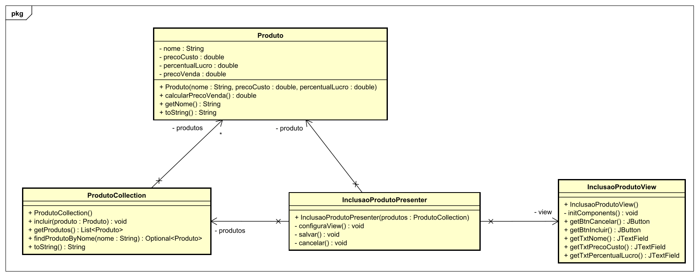

# MVP Inclusão de Produto

## Descrição do Projeto

Este projeto implementa um sistema simples de inclusão de produtos utilizando o padrão **MVP (Model-View-Presenter)**. O sistema consiste em uma interface gráfica para entrada de dados, classes para gerenciamento de produtos e lógica de apresentação para coordenar as interações entre a interface e os modelos.

## Estrutura do Projeto

O projeto é dividido em pacotes conforme o padrão MVP:

### Pacotes

1. **`com.mycompany.mvpinclusaoproduto.model`**:
   - Contém a classe `Produto`, que representa o modelo de um produto com suas propriedades e lógica de negócios.
   
2. **`com.mycompany.mvpinclusaoproduto.view`**:
   - Contém a classe `InclusaoProdutoView`, que implementa a interface gráfica para entrada de dados.
   
3. **`com.mycompany.mvpinclusaoproduto.presenter`**:
   - Contém a classe `InclusaoProdutoPresenter`, responsável por coordenar a interação entre a visão (view) e o modelo.

4. **`com.mycompany.mvpinclusaoproduto.db`**:
   - Contém a classe `ProdutoCollection`, que simula um banco de dados para armazenar os produtos.

### Diagrama de Classes

O diagrama de classes abaixo ilustra a relação entre as principais classes do projeto:



### Classes Principais

- **`Produto`**:
  - Representa um produto com os seguintes atributos:
    - Nome
    - Preço de Custo
    - Percentual de Lucro
    - Preço de Venda (calculado automaticamente com base no preço de custo e percentual de lucro).
  - Inclui validação básica e lógica para cálculo do preço de venda.

- **`InclusaoProdutoView`**:
  - Fornece a interface gráfica para o usuário inserir os dados do produto.
  - Contém botões para "Incluir" e "Cancelar" e campos de texto para entrada de dados.

- **`InclusaoProdutoPresenter`**:
  - Implementa a lógica de apresentação.
  - Valida os dados fornecidos pelo usuário e interage com a classe `ProdutoCollection` para armazenar o produto.
  - Mostra mensagens de sucesso ou erro utilizando `JOptionPane`.

- **`ProdutoCollection`**:
  - Gerencia a lista de produtos.
  - Permite incluir produtos e realizar buscas por nome.

## Funcionalidades

1. **Adicionar Produto**:
   - O usuário insere o nome, preço de custo e percentual de lucro do produto.
   - O sistema valida os dados e, se forem válidos, calcula o preço de venda e adiciona o produto à coleção.

2. **Cancelar Operação**:
   - Fecha a janela sem salvar os dados.

3. **Listar Produtos (apenas no console)**:
   - Os produtos armazenados na coleção são exibidos no console ao incluir um novo produto.

## Requisitos

- **Java SE** (8 ou superior)
- **IDE** ou terminal com suporte a projetos Java
- Biblioteca Swing (padrão em Java SE)

## Como Executar

1. Clone ou baixe este repositório.
2. Certifique-se de que o diagrama `diagrama_de_classes.svg` esteja na raiz do projeto.
3. Compile e execute a classe principal `MVPInclusaoProduto`:

   ```bash
   javac com/mycompany/mvpinclusaoproduto/*.java
   java com.mycompany.mvpinclusaoproduto.MVPInclusaoProduto
